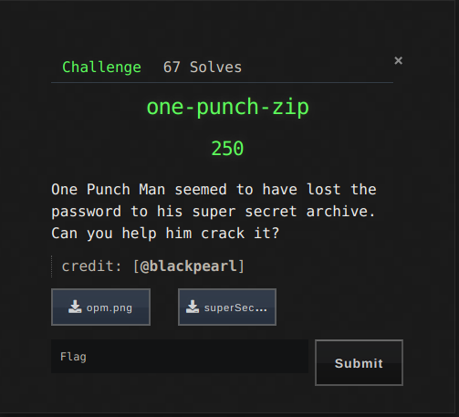
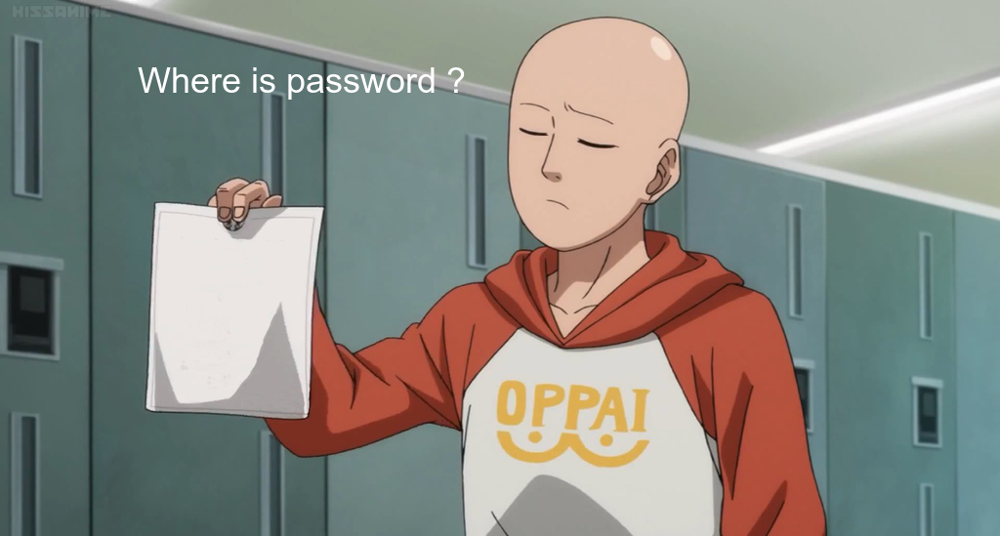
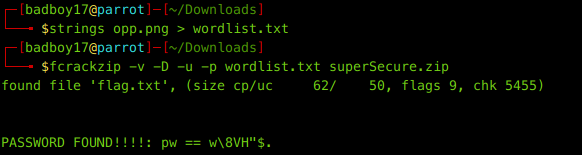
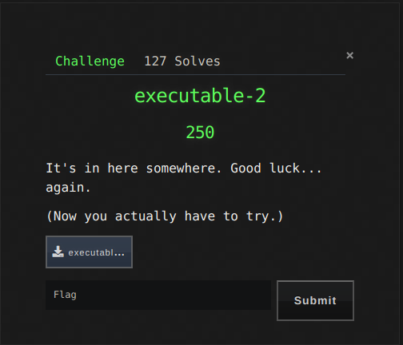
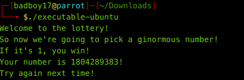
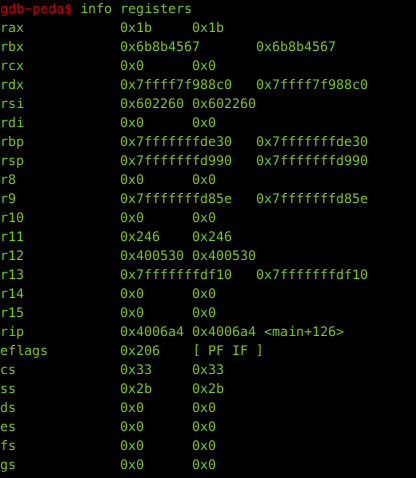

BCACTF a 7-days long CTF for High Schoolers had some pretty good challenges. Here are some of the writeups which were my favourites.


### Forensics
[One-Punch-Zip](#one-punch-zip)

### Binary Exploitation
[Executable-2](#executable-2)

***
***

# Forensics 

## one-punch-zip


With 67 solves this challenge was a medium chall. A png and a password protected zip was given.




So first approach was to test strings, LSB, exif...but nothing juicy was there. In the png Saitama was holding a piece of paper. Well if you're an anime fan it was a scene from S01E05 which wasn't useful at all xD. I decided to use rockyou against the zip but then I remembered a chall from another CTF which was somewhat similar to this one. So I formed a wordlist out of the strings of png.

```
strings opm.png > wordlist.txt
```
and then I used fcrackzip to crack the zip.
```
fcrackzip -v -D -u -p wordlist.txt superSecure.zip
```


And luckily we found the password and the flag too.
>bcactf{u5ing_4ll_string5_0f_1mag3_@s_dictionary?}

***
***

# Binary Exploitation

## Executable-2



Well this challenge was more of a reversing chall. It was a kind of successor to **executable** chall which actually had the flag in strings xD. An ELF executable huh!.



But now this time We really have to pick a ginormous number. Let's fire GDB...and looking at all the functions, we see only main which is of use. Disassembling main.
We see a call to cmp function before exiting.


Let's set a breakpoint here :
>b *0x00000000004006a4

And run. It hits the breakpoint. Let's check the registers.



We see that **rbx** has value **0x6b8b4567** which is hex equivalent of **1804289383**. Huh ! It asks us if it is 1. So let's make the value of rbx to 1.

>set $rbx=1

and then continuing the program we get a brainfuck string which is pretty much our required flag except it was ROT10... Don't know why but the real flag didn't made any sense.

>bcactf{Kboxd_ohomedklvoc_pex_S_drsxu_cy_cnuptrasgoebisaegobktjxmhlfksrasgeoib}

Voila....that was some of the writeups. We ended at **28** overall.
That's it from Team [Dc1ph3R](https://ctftime.org/team/69272)